## 图解Golang的GC算法

<h6>摘自https://mp.weixin.qq.com/s/_h0-8hma5y_FHKBeFuOOyw，原作者 RyuGou</h6>
<h6>https://www.jianshu.com/p/9c8e56314164  http://legendtkl.com/2017/04/28/golang-gc/</h6>

## Description

虽然`Golang`的GC自打一开始，就被人所诟病，但是经过这么多年的发展，Golang的GC已经改善了非常多，变得非常优秀了。

以下是`Golang GC`算法的里程碑：

- v1.1 STW

- v1.3 Mark STW, Sweep 并行

- v1.5 三色标记法

- v1.8 hybrid write barrier

经典的GC算法有三种： `引用计数(reference counting)`、 `标记-清扫(mark&sweep)`、 `复制收集(CopyandCollection)`。

Golang的GC算法主要是基于`标记-清扫(markandsweep)`算法，并在此基础上做了改进。因此，在此主要介绍一下`标记-清扫(mark and sweep)`算法，关于`引用计数(refer
ence counting)`和`复制收集(copy and collection)`可自行百度。

## 经典GC算法简单介绍

这一小节介绍三种经典的 GC 算法：引用计数（reference counting）、标记-清扫（mark & sweep）、节点复制（Copying Garbage Collection），分代收集（Generational Garbage Collection）。

### 引用计数
引用计数的思想非常简单：每个单元维护一个域，保存其它单元指向它的引用数量（类似有向图的入度）。当引用数量为 0 时，将其回收。引用计数是渐进式的，能够将内存管理的开销分布到整个程序之中。C++ 的 share_ptr 使用的就是引用计算方法。

引用计数算法实现一般是把所有的单元放在一个单元池里，比如类似 free list。这样所有的单元就被串起来了，就可以进行引用计数了。新分配的单元计数值被设置为 1（注意不是 0，因为申请一般都说 ptr = new object 这种）。每次有一个指针被
设为指向该单元时，该单元的计数值加 1；而每次删除某个指向它的指针时，它的计数值减 1。当其引用计数为 0 的时候，该单元会被进行回收。虽然这里说的比较简单，实现的时候还是有很多细节需要考虑，比如删除某个单元的时候，那么它指向的所有单元
都需要对引用计数减 1。那么如果这个时候，发现其中某个指向的单元的引用计数又为 0，那么是递归的进行还是采用其他的策略呢？递归处理的话会导致系统颠簸。关于这些细节这里就不讨论了，可以参考文章后面的给的参考资料。

##### 优点

<li>渐进式。内存管理与用户程序的执行交织在一起，将 GC 的代价分散到整个程序。不像标记-清扫算法需要 STW (Stop The World，GC 的时候挂起用户程序)。</li>

<li>算法易于实现。</li>

<li>内存单元能够很快被回收。相比于其他垃圾回收算法，堆被耗尽或者达到某个阈值才会进行垃圾回收。</li>

##### 缺点

<li>原始的引用计数不能处理循环引用。大概这是被诟病最多的缺点了。不过针对这个问题，也除了很多
解决方案，比如强引用等。</li>
<li>维护引用计数降低运行效率。内存单元的更新删除等都需要维护相关的内存单元的引用计数，相比于
一些追踪式的垃圾回收算法并不需要这些代价。</li>
<li>单元池 free list 实现的话不是 cache-friendly 的，这样会导致频繁的 cache miss，降
低程序运行效率。</li>

### 标记-清扫

标记-清扫算法是第一种自动内存管理，基于追踪的垃圾收集算法。算法思想在 70 年代就提出了，是一种非
常古老的算法。内存单元并不会在变成垃圾立刻回收，而是保持不可达状态，直到到达某个阈值或者固定时间
长度。这个时候系统会挂起用户程序，也就是 STW，转而执行垃圾回收程序。垃圾回收程序对所有的存活单元进
行一次全局遍历确定哪些单元可以回收。算法分两个部分：标记（mark）和清扫（sweep）。标记阶段表明所
有的存活单元，清扫阶段将垃圾单元回收。可视化可以参考下图。

标记-清扫算法的优点也就是基于追踪的垃圾回收算法具有的优点：避免了引用计数算法的缺点（不能处理
循环引用，需要维护指针）。缺点也很明显，需要STW。

### 三色标记算法

三色标记算法是对标记阶段的改进，原理如下：

- 起初所有对象都是白色。

- 从根出发扫描所有可达对象，标记为灰色，放入待处理队列。

- 从队列取出灰色对象，将其引用对象标记为灰色放入队列，自身标记为黑色。

- 重复 3，直到灰色对象队列为空。此时白色对象即为垃圾，进行回收。

三色标记的一个明显好处是能够让用户程序和 mark 并发的进行，具体可以参考论文：《On-the-fly garbage collection: an exercise in coop
eration.》。Golang 的 GC 实现也是基于这篇论文，后面再具体说明。

### 节点复制
节点复制也是基于追踪的算法。其将整个堆等分为两个半区（semi-space），一个包含现有数据，另一个包含已被废弃的数据。节点复制式垃圾收集从切换（flip）两个半区的角色开始，然后收集器在老的半区，也就是 Fromspace 中遍历存活的数据结构，在第一次访问某个单元时把它复制到新半区，也就是 Tospace 中去。在 Fromspace 中所有存活单元都被访问过之后，收集器在 Tospace 中建立一个存活数据结构的副本，用户程序可以重新开始运行了。

##### 优点
所有存活的数据结构都缩并地排列在 Tospace 的底部，这样就不会存在内存碎片的问题。
获取新内存可以简单地通过递增自由空间指针来实现。

##### 缺点
内存得不到充分利用，总有一半的内存空间处于浪费状态。

### 分代收集
基于追踪的垃圾回收算法（标记-清扫、节点复制）一个主要问题是在生命周期较长的对象上浪费时间（长生命周期的对象是不需要频繁扫描的）。同时，内存分配存在这么一个事实 “most object die young”。基于这两点，分代垃圾回收算法将对象按生命周期长短存放到堆上的两个（或者更多）区域，这些区域就是分代（generation）。对于新生代的区域的垃圾回收频率要明显高于老年代区域。

分配对象的时候从新生代里面分配，如果后面发现对象的生命周期较长，则将其移到老年代，这个过程叫做 promote。随着不断 promote，最后新生代的大小在整个堆的占用比例不会特别大。收集的时候集中主要精力在新生代就会相对来说效率更高，STW 时间也会更短。

## 标记-清扫(Mark And Sweep)算法

此算法主要有两个主要的步骤：

- 标记(Mark phase)

- 清除(Sweep phase)

第一步，找出不可达的对象，然后做上标记。
第二步，回收标记好的对象。

操作非常简单，但是有一点需要额外注意：mark and sweep算法在执行的时候，需要程序暂停！即 stop the world。
也就是说，这段时间程序会卡在哪儿。故中文翻译成 卡顿。

我们来看一下图解：

开始标记，程序暂停。程序和对象的此时关系是这样的：

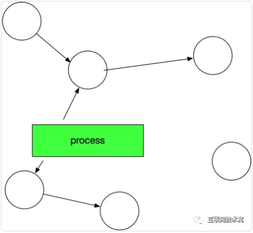

然后开始标记，process找出它所有可达的对象，并做上标记。如下图所示：

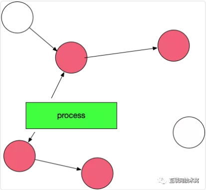

标记完了之后，然后开始清除未标记的对象：

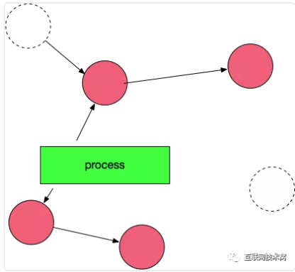

然后垃圾清除了，变成了下图这样。

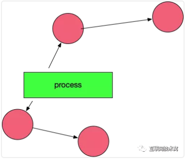

最后，停止暂停，让程序继续跑。然后循环重复这个过程，直到process生命周期结束。

##　标记-清扫(Mark And Sweep)算法存在什么问题？

标记-清扫(Mark And Sweep)算法这种算法虽然非常的简单，但是还存在一些问题：

-　STW，stop the world；让程序暂停，程序出现卡顿。

-　标记需要扫描整个heap

-　清除数据会产生heap碎片

这里面最重要的问题就是：mark-and-sweep 算法会暂停整个程序。

Go是如何面对并这个问题的呢？

##　三色并发标记法

我们先来看看Golang的三色标记法的大体流程。

首先：程序创建的对象都标记为白色。

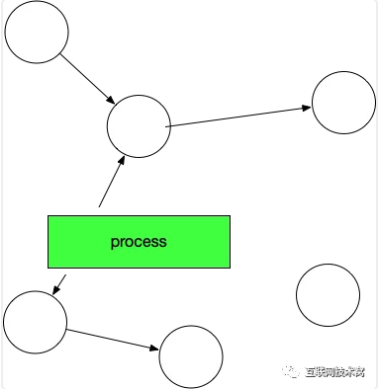

gc开始：扫描所有可到达的对象，标记为灰色

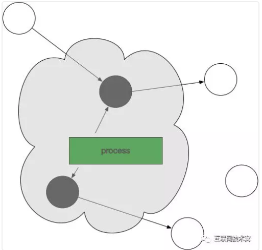

从灰色对象中找到其引用对象标记为灰色，把灰色对象本身标记为黑色

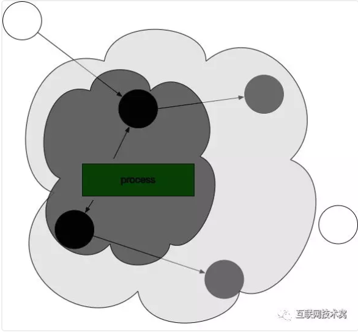

监视对象中的内存修改，并持续上一步的操作，直到灰色标记的对象不存在

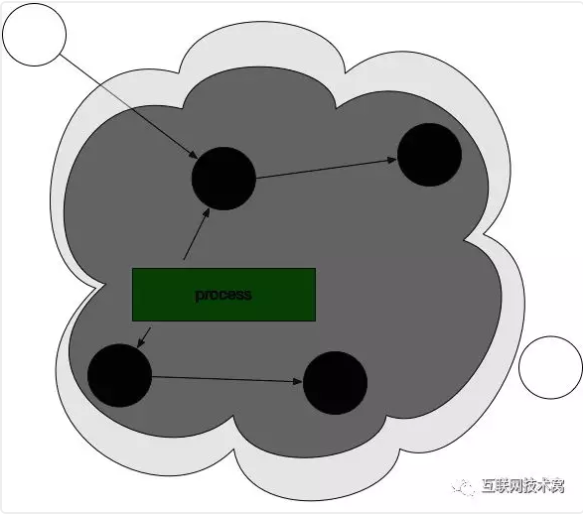

此时，gc回收白色对象。

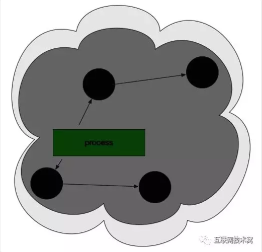

最后，将所有黑色对象变为白色，并重复以上所有过程。

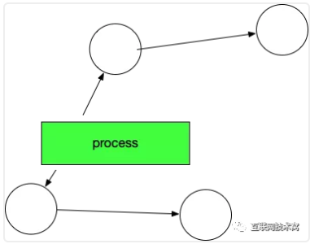

好了，大体的流程就是这样的，让我们回到刚才的问题：Go是如何解决标记-清除(mark and sweep)算法中
的卡顿(stw，stop the world)问题的呢？

## gc和用户逻辑如何并行操作？

标记-清除(mark and sweep)算法的STW(stop the world)操作，就是runtime把所有的线程全部冻结掉，所有的线程全部冻结意味着用户逻辑是暂停的。这样所有的对象都不会被修改了，这时候去扫描是绝对安全的。

Go如何减短这个过程呢？标记-清除(mark and sweep)算法包含两部分逻辑：标记和清除。
我们知道Golang三色标记法中最后只剩下的黑白两种对象，黑色对象是程序恢复后接着使用的对象，如果不碰触黑色对象，只清除白色的对象，肯定不会影响程序逻辑。所以:`清除操作和用户逻辑可以并发`。

标记操作和用户逻辑也是并发的，用户逻辑会时常生成对象或者改变对象的引用，那么标记和用户逻辑如何并发呢？

## process新生成对象的时候，GC该如何操作呢？不会乱吗？

我们看如下图，在此状态下：process程序又新生成了一个对象，我们设想会变成这样：

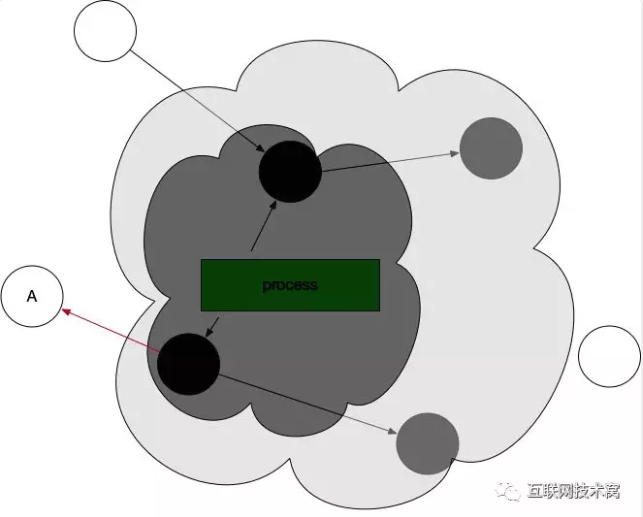

但是这样显然是不对的，因为按照三色标记法的步骤，这样新生成的对象A最后会被清除掉，这样会影响程序逻辑。

Golang为了解决这个问题，引入了 写屏障这个机制。
写屏障：该屏障之前的写操作和之后的写操作相比，先被系统其它组件感知。
通俗的讲：就是在gc跑的过程中，可以监控对象的内存修改，并对对象进行重新标记。(实际上也是超短暂的stw，然后对对象进行标记)

在上述情况中，`新生成的对象，一律都标位灰色`即下图：

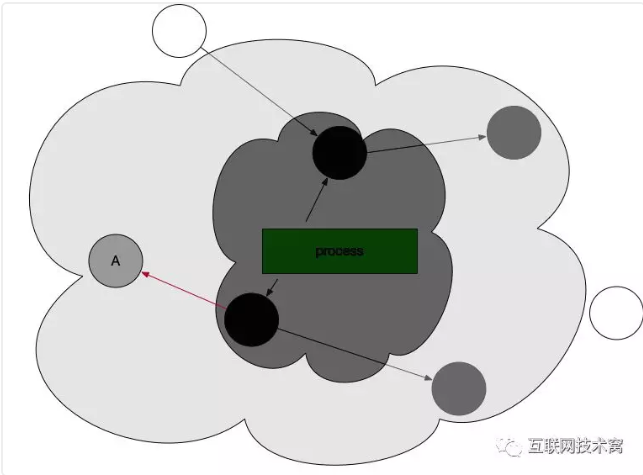

## 那么，灰色或者黑色对象的引用改为白色对象的时候，Golang是该如何操作的？

看如下图，一个黑色对象引用了曾经标记的白色对象。

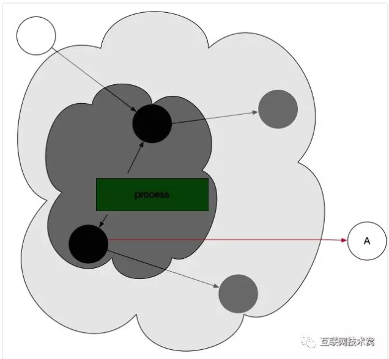

这时候，写屏障机制被触发，向GC发送信号，GC重新扫描对象并标位灰色。

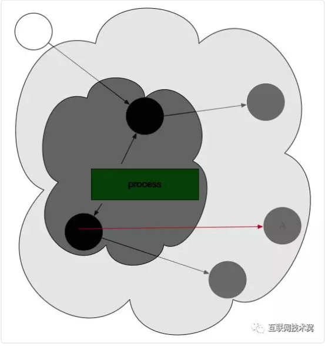

因此，gc一旦开始，无论是创建对象还是对象的引用改变，都会先变为灰色。

## Golang的GC

## 三色标记
首先当垃圾回收器第⼀次启动的时候，它把所有的对象都看成⽩色的，如果这个对象引⽤了另外⼀个对象，那么被引用的对象称之为灰色的，把灰色的放入一个
队列里去，那么当它第⼀次扫描完了以后这个无非就是变成两种状态，⽩色的和灰色的，⽩色的不属于我们要管的。

接下来扫描所有灰色的对象，灰色对象从队列里拿出来进行扫描，灰色对象被拿出来以后灰色对象本身被标记为黑色的。如果它引用了其他对象那么这个对象重
新变成灰色的，它会放入队列里面去，那么黑色对象肯定是活着的不⽤管了，那么通过这样⼀级⼀级的扫描最终因为灰色对象被放⼊队列里面然后灰色对象拿出
来进行扫描，灰色对象本⾝变成黑色的，最终里面就变成两种对象，⼀种是活下来黑色的，第⼆种是所有扫描都没有人碰过的⽩色，那么黑色的都是活着的，⽩色
的都是统统干掉的。

那么最早的扫描是从哪来的呢，我们称之为从根 Root 对象来的，⽣命周期可以保证的对象是根对象，线程栈本身就是⼀个根，线程栈里面可能存了某个对象的
指针，那线程栈就会引用那个对象，所以像全局变量、线程栈这些就是根对象。从它们开始扫描，如果全局变量没有引⽤任何东西，线程栈也没有引用任何东西
，那这些根对象引用的对象肯定可以干掉。全局变量就不说了，线程栈就表⽰了当前正在引⽤的那对象，如果线程栈都没有引⽤过，那些对象肯定不要了，⽩色
对象可以去掉了。

从根对象开始扫描从⼀开始⼤家都是白的，如果根对象有引用，那个对象变成灰色的，灰色对象依次扫描以后就剩下变成两种对象，白色对象和灰色对象，白色
对象先放在这，灰色对象放入队列里面去，接下来我们从队列里把灰色对象取出来，看看灰色对象引用了什么对象，灰色对象本身变成黑色的它肯定活下来的，
因为它是被别人引用了才会放入队列里面，所以它从灰色变成黑色肯定是活下来的。通过这样把灰色对象一级一级进行递归扫描以后最后这个队列被清空了，剩
下来的世界只有两种对象，⼀种是黑色的肯定被引⽤过，第⼆种是没有被引用过的白色对象，黑白两色，黑色活着白色干掉，这就是很典型的三色标记

## golang垃圾回收使用的标记清理
### STW(stop the world）
在扫描之前执行 STW（Stop The World）操作，就是Runtime把所有的线程全部冻结掉，所有的线程全部冻结掉意味着用户逻辑肯定都是暂停的，所有的用
户对象都不会被修改了，这时候去扫描肯定是安全的，对象要么活着要么死着，所以会造成在 STW 操作时所有的线程全部暂停，用户逻辑全部停掉，中间暂停
时间可能会很长，⽤户逻辑对于用户的反应就中止了。

如何减短这个过程呢， STW过程中有两部分逻辑可以分开处理。我们看黑白对象，扫描完结束以后对象只有黑白对象，黑色对象是接下来程序恢复之后需要使
用的对象，如果不碰黑色对象只回收白色对象的话肯定不会给用户逻辑产⽣关联，因为白色对象肯定不会被用户线程引用的，所以回收操作实际上可以和用户
逻辑并发的，因为可以保证回收的所有目标都不会被用户线程使用，所以第一步回收操作和用户逻辑可以并发，因为我们回收的是白色对象，扫描完以后白色
对象不会被全局变量引用、线程栈引用。回收白色对象肯定不会对用户线程产⽣竞争，首先回收操作肯定可以并发的，既然可以和用户逻辑并发，这样回收操
作不放在 STW时间段里面缩短 STW 时间。

### 写屏障
写屏障：该屏障之前的写操作和之后的写操作相比，先被系统其它组件感知。

刚把⼀个对象标记为⽩色的，⽤户逻辑执行了突然引用了它，或者说刚刚扫描了 100 个对象正准备回收结果⼜创建了1000个对象在里面，因为没法结束没办法
扫描状态不稳定，像扫描操作就⽐较麻烦。于是引入了写屏障的技术。

，先做⼀次很短暂的STW，为什么需要很短暂的呢，它首先要执行⼀些简单的状态处理，接下来对内存进⾏扫描，这个时候用户逻辑也可以执行。用户所有新建
的对象认为就是黑色的，这次不扫描了下次再说，新建对象不关心了，剩下来处理已经扫描过的对象
是不是可能会出问题，已经扫描后的对象可能因为⽤户逻辑造成对象状态发⽣改变，所以对扫描过后的对象使⽤操作系统写屏障功能用来监控用户逻辑这段内
存。任何时候这段内存发⽣引用改变的时候就会造成写屏障发⽣⼀个信号，垃圾回收器会捕获到这样的信号后就知道这个对象发⽣改变，然后重新扫描这个对象
，看看它的引用或者被引用是否被改变，这样利用状态的重置从⽽实现当对象状态发⽣改变的时候依然可以判断它是活着的还是死的，这样扫描操作实际上可以
做到⼀定程度上的并发，因为它没有办法完全屏蔽STW起码它当开始启动先拿到⼀个状态，但是它的确可以把扫描时间缩短，现在知道了扫描操作和回收操作都
可以用户并发。

### golang回收的本质
实际上把单次暂停时间分散掉了，本来程序执⾏可能是“用户逻辑、大段GC、用户逻辑”，那么分散以后实际上变成了“用户逻辑、小段 GC、用户逻辑、小段GC
、用户逻辑”这样。其实这个很难说 GC 快了。因为被分散各个地⽅以后可能会频繁的保存用户状态，因为垃圾回收之前要保证用户状态是稳定的，原来只需要
保存一次就可以了现在需要保存多次，很难说这种方式就一定让程序变的快了

#### 辅助回收
Go 语言“一段用户逻辑，一段并发扫描Scan，一段并发回收Collect”，那可能会造成这种状态：描的速度跟不上⽤户分配的速度，会造成扫描永远结束不了，
结束不了的情况下很⼤的麻烦在于垃圾回收就会出问题，用户内存膨胀，必须在性能和内存膨胀之间做出平衡。

以 Go 语言如果发现扫描后回收的速度跟不上分配的速度它依然会把用户逻辑暂停，用户逻辑暂停了以后也就意味着不会有新的对象出现，同时会把用户线程抢
过来加入到垃圾回收里面加快垃圾回收的速度。因为并行有四个核，有三个核用户线程执行只有⼀个核在做垃圾回收，那⼀个核就有可能跑不过三个核，那把那
三个核也抢过来做垃圾回收。这样一来原来的并发还是变成了STW，还是得把用户线程暂停掉，要不然扫描和回收没完没了了停不下来，因为新分配对象⽐回收
快，所以这种东西叫做辅助回收

#### 控制器
很多语言比如 Java 对垃圾回收器做了很多控制开关，是因为那些算法未必适合当前的这种算法，有些语言⽐较适合并发扫描有些语言不适合，甚至是像做大
数据计算完全把GC关掉就是⼀直把内存用完了导致系统崩溃了为止，只不过崩溃之前保证把状态保存然后重新执行这个进程然后进行密集计算，把垃圾回收那段
时间抢出来用来做密集计算。所以说垃圾回收器的算法不是万能的，它也没有办法做到真正意义上的智能。

Java、 Go 语言都有垃圾回收预值，甚至来决定预值什么时候启动垃圾回收，像Go语言有百分比来控制到底有多大合适，这个 GC堆到底分配多大合理，这都
需要在了解垃圾回收器原理情况下做动态调节。因为我们的服务程序很复杂，在服务器上可能长时间运⾏，垃圾回收器算法对性能影响很关键的.

Go 语言垃圾回收器⼀直被⼤家说实现的是原始版，因为Go早期版本对垃圾回收器预值怎么触发的特别蠢，第⼀次回收的时候回收完了剩下来对象是2M，那么下
次垃圾回收的内存消耗变成4M，假设第⼀次回收之前内存是 100G，下次回收可能就变成 200G，可问题是下次回收⽤不了200G，可能第⼀次回收用的 100G 
是引⽤了大字典，在下次回收之前这字典清空了接下来⼀直用⼏⼗M，垃圾回收器很难启动，所以 Go 语言在后台用⼀个循环线程扫描，每2分钟发现不执行就
强制回收⼀次，这样的做法显然比较蠢。后来在 1.5 版本引入⼀个控制器，控制器有点像Java语言动态概念，当这次回收释放⽐例、或者是这些对象相关⼀
些数据，控制器和辅助回收的作⽤GitChat来对预值动态调整决定下次回收

## 参考文献：

[Golang’s Real-time GC in Theory and PracticeGolang's realtime garbage collectorGolang 垃圾回收剖析](https://mp.weixin.qq.com/s?__biz=MzU4ODczMDg5Ng==&mid=2247483688&idx=1&sn=46742e533886fe8b2fb91d79cf5144eb&scene=21#wechat_redirect)

[《On-the-fly garbage collection: an exercise in cooperation》]()