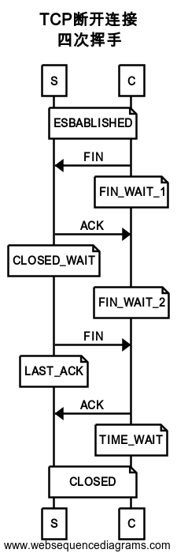

# Network Protocol

---

## 目录

- <a href="#model">网络协议模型</a>
- <a href="#description">Description</a>
- <a href="#Http">HTTP</a>

## <a name="model">网络协议模型</a>

OSI 模型：物理层 —— 数据链路层 —— 网络层 —— 传输层 —— 会话层 —— 表示层 —— 应用层

应用层 文件传输，文件管理，电子邮件的信息处理——apdu

表示层 确保一个系统的应用层发送的消息可以被另一个系统的应用层读取，编码转换，数据解析，管理数据的解密和加密，最小单位——ppdu

会话层 负责在网络中的两节点建立，维持和终止通信，在一层协议中，可以解决节点连接的协调和管理问题。包括通信连接的建立，保持会话过程通信连接的畅通，两节点之间的对话，决定通信是否被终端一斤通信终端是决定从何处重新发送，最小单位——spdu

传输层 定义一些传输数据的协议和端口。传输协议同时进行流量控制，或是根据接收方接收数据的快慢程度，规定适当的发送速率，解决传输效率及能力的问题——tpdu

网络层 控制子网的运行，如逻辑编址，分组传输，路由选择最小单位——分组（包）报文

数据链路层 主要是对物理层传输的比特流包装，检测保证数据传输的可靠性，将物理层接收的数据进行 MAC（媒体访问控制）地址的封装和解封装，也可以简单的理解为物理寻址。交换机就处在这一层，最小的传输单位——帧 FDDI

物理层 定义物理设备的标准，主要对物理连接方式，电气特性，机械特性等制定统一标准，传输比特流，因此最小的传输单位——位（比特流）

TCP/IP 模型：链路层 —— 网络层 —— 传输层 —— 应用层

具体参考：


## <a name="description">Description</a>

&emsp;&emsp;TCP/IP 在大多数情况下是指利用 IP 进行通信是所必须用到的协议群的昵称。具体来说，
IP 或 ICMP、TCP 或 UDP、TELNET 或 FTP、以及 HTTP 等都属于 TCP/IP 协议。他们与 TCP 或 IP 的关系紧密，
是互联网必不可少的组成部分。TCP/IP 一词泛指这些协议，因此，有时也称 TCP/IP 为网际协议群。

&emsp;&emsp;网络中传输的数据包由两部分组成：一部分是由协议所要用到的首部，另一部分是上一层传过来的数据。

#### TCP 三次握手


1、A 客户端发起请求，通过发送 SYN=1，随机序列 seq=1001

2、B 服务端接受请求，然后发送 SYN=1，ACK=1，AckNumber=1002（1001+1），随机序列 seq=3001

3、A 客户端接受确认请求，然后发送 ACK=1，AckNumber=3002(3001+1)

```js
//CLOSED：起始状态，无任何连接。

//LISTEN：服务端建立socket之后需要listen进入LISTEN(侦听)模式，侦听来自远方的TCP连接请求。

//SYN_SENT：客户端建立socket之后需要connect服务器，向服务端发送SYN=j(随机数)申请连接，然后会进入SYN_SENT状态。

//SYN_RCVD：服务端在** 侦听模式 **下收到SYN后会向客户端回应ACK=j+1，同时发送SYN=k，然后进入SYN_RCVD状态。

//ESTABLISHED：客户端收到ACK后进行验证，同时回应服务端发来的SYN，返回ACK=k+1，然后进入ESTABLISHED状态。
// 服务端收到最后一个ACK后验证，然后进入ESBABLESHED。表示双方的连接建立完成，可以进行数据传输。
```

#### TCP 四次分手



1、A 客户端发起断开请求，客户端发送一个 FIN=M，用来关闭客户端到服务器端的数据传送，
客户端进入 FIN_WAIT_1 状态。意思是说"我客户端没有数据要发给你了"，但是如果你服务器端还有数据没有发送完成，
则不必急着关闭连接，可以继续发送数据。

2、服务器端收到 FIN 后，先发送 ack=M+1，告诉客户端，你的请求我收到了，但是我还没准备好，请继续你等我的消息。
这个时候客户端就进入 FIN_WAIT_2 状态，继续等待服务器端的 FIN 报文。

3、当服务器端确定数据已发送完成，则向客户端发送 FIN=N 报文，告诉客户端，好了，我这边数据发完了，准备好关闭连接了。
服务器端进入 LAST_ACK 状态。

4、客户端收到 FIN=N 报文后，就知道可以关闭连接了，但是他还是不相信网络，怕服务器端不知道要关闭，所以发送 ack=N+1 后进入 TIME_WAIT 状态
，如果 Server 端没有收到 ACK 则可以重传。服务器端收到 ACK 后，就知道可以断开连接了。客户端等待了 2MSL 后依然没有收到回复，
则证明服务器端已正常关闭，那好，我客户端也可以关闭连接了。最终完成了四次握手。

```js
//一般由客户端主动断开连接，服务端只做被动连接。但是如果有必要，服务端也可主动断开连接。

//FIN_WAIT_1：在ESTABLISHED(连接)状态下，主动断开连接会向对端发送FIN，然后进入FIN_WAIT_1状态。

//CLOSED_WAIT：被动断开连接的一端收到FIN之后，会回应ACK，然后进入CLOSED_WAIT状态，
// 在CLOSED_WAIT状态下，连接只能发送数据不能接收数据。

//FIN_WAIT_2：主动断开连接的一端收到FIN的ACK回应后会进入FIN_WAIT_2状态。此时无法再发送数据但是可以接受数据。

//LAST_ACK：被动断开连接的一端在缓冲区数据发送完成后会发送FIN然后进入LAST_ACK状态。如果程序健壮性较差，
// 在socket收到文件结束符之后没有关闭socket，此处不会发出FIN，导致连接停留在CLOSED_WAIT&FIN_WAIT_2状态。

//TIME_WAIT：主动断开连接的一端在收到对端的FIN后回应ACK然后进入TIME_WAIT。此状态下连接已断开，
// 但为了避免最后一个ACK在网络中迷路，而导致的状态紊乱，端口会被保留2*MSL的时长。

//CLOSED：在TIME_WAIT状态停留时间达到2*MSL之后进入CLOSED状态，表示无任何连接
```

## <a name="Http">HTTP</a>

#### 请求报文

&emsp;&emsp;HTTP 协议是以 ASCII 码传输，建立在 TCP/IP 协议之上的应用层规范。规范把 HTTP 请求分为三个部分：

- 状态行
- 请求头
- 消息主体。

HTTP 的基本请求方法：GET，POST，PUT，DELETE。

&emsp;&emsp;GET 可提交的数据量受到 URL 长度的限制，POST 对于数据的没有大小限制。HTTP 协议中规定 POST 提交的数据必须在 body 部分中，
但是协议中没有规定数据使用哪种编码方式或者数据格式。而服务端通常是根据请求头（headers）中的 Content-Type 字段来获知请求中的
消息主体是用何种方式编码。两种常用的 POST 提交方式：`application/x-www-form-urlencoded`（浏览器的原生表单，如果不设置 enctype 属性，那么最终就会以 `application/x-www-form-urlencoded`
方式提交数据） 和 `multipart/form-data`（我们使用表单上传文件时，必须让表单的 enctype 等于 multipart/form-data）

#### 响应报文

- 状态行
- 响应头(Response Header)
- 响应正文

&emsp;&emsp;状态行由协议版本、数字形式的状态代码、及相应的状态描述，各元素之间以空格分隔。

常用状态码：

```bash
200 OK 客户端请求成功
301 Moved Permanently 请求永久重定向
302 Moved Temporarily 请求临时重定向
304 Not Modified 文件未修改，可以直接使用缓存的文件。
400 Bad Request 由于客户端请求有语法错误，不能被服务器所理解。
401 Unauthorized 请求未经授权。这个状态代码必须和WWW-Authenticate报头域一起使用
403 Forbidden 服务器收到请求，但是拒绝提供服务。服务器通常会在响应正文中给出不提供服务的原因
404 Not Found 请求的资源不存在，例如，输入了错误的URL
500 Internal Server Error 服务器发生不可预期的错误，导致无法完成客户端的请求。
503 Service Unavailable 服务器当前不能够处理客户端的请求，在一段时间之后，服务器可能会恢复正常
```

#### 条件 GET

#### 持久连接

&emsp;&emsp;我们知道 HTTP 协议采用“请求-应答”模式，当使用普通模式，即非 Keep-Alive 模式时，每个请求/应答客户和服务器都要新建一个连接，完成之后立即断开连接（HTTP 协议为无连接的协议）；当使用 Keep-Alive 模式（又称持久连接、连接重用）时，Keep-Alive 功能使客户端到服务器端的连接持续有效，当出现对服务器的后继请求时，Keep-Alive 功能避免了建立或者重新建立连接。

&emsp;&emsp;在 HTTP 1.0 版本中，并没有官方的标准来规定 Keep-Alive 如何工作，因此实际上它是被附加到 HTTP 1.0 协议上，如果客户端浏览器支持 Keep-Alive ，那么就在 HTTP 请求头中添加一个字段 Connection: Keep-Alive，当服务器收到附带有 Connection: Keep-Alive 的请求时，它也会在响应头中添加一个同样的字段来使用 Keep-Alive 。这样一来，客户端和服务器之间的 HTTP 连接就会被保持，不会断开（超过 Keep-Alive 规定的时间，意外断电等情况除外），当客户端发送另外一个请求时，就使用这条已经建立的连接。

&emsp;&emsp;在 HTTP 1.1 版本中，默认情况下所有连接都被保持，如果加入 "Connection: close" 才关闭。目前大部分浏览器都使用 HTTP 1.1 协议，也就是说默认都会发起 Keep-Alive 的连接请求了，所以是否能完成一个完整的 Keep-Alive 连接就看服务器设置情况

&emsp;&emsp;由于 HTTP 1.0 没有官方的 Keep-Alive 规范，并且也已经基本被淘汰，以下讨论均是针对 HTTP 1.1 标准中的 Keep-Alive 展开的。

注意：

- HTTP Keep-Alive 简单说就是保持当前的 TCP 连接，避免了重新建立连接。

- HTTP 长连接不可能一直保持，例如 Keep-Alive: timeout=5, max=100，表示这个 TCP 通道可以保持 5 秒，max=100，表示这个长连接最多接收 100 次请求就断开。

- HTTP 是一个无状态协议，这意味着每个请求都是独立的，Keep-Alive 没能改变这个结果。另外，Keep-Alive 也不能保证客户端和服务器之间的连接一定是活跃的，在 HTTP1.1 版本中也如此。唯一能保证的就是当连接被关闭时你能得到一个通知，所以不应该让程序依赖于 Keep-Alive 的保持连接特性，否则会有意想不到的后果。

- 使用长连接之后，客户端、服务端怎么知道本次传输结束呢？两部分：1. 判断传输数据是否达到了 Content-Length 指示的大小；2. 动
  态生成的文件没有 Content-Length ，它是分块传输（chunked），这时候就要根据 chunked 编码来判断，chunked 编码的数据在最后有一
  个空 chunked 块，表明本次传输数据结束，详见这里。什么是 chunked 分块传输呢？下面我们就来介绍一下。

#### Transfer-Encoding

#### HTTP Pipelining（HTTP 管线化）

&emsp;&emsp;默认情况下 HTTP 协议中每个传输层连接只能承载一个 HTTP 请求和响应，浏览器会在收到上一个请求的响应之后，再发送下一个请求。在使用持久连接的情况下，某个连接上消息的传递类似于请求 1 -> 响应 1 -> 请求 2 -> 响应 2 -> 请求 3 -> 响应 3。

&emsp;&emsp;HTTP Pipelining（管线化）是将多个 HTTP 请求整批提交的技术，在传送过程中不需等待服务端的回应。使用 HTTP Pipelining 技术之后，某个连接上的消息变成了类似这样请求 1 -> 请求 2 -> 请求 3 -> 响应 1 -> 响应 2 -> 响应 3。

注意下面几点：

- 管线化机制通过持久连接（persistent connection）完成，仅 HTTP/1.1 支持此技术（HTTP/1.0 不支持）
- 只有 GET 和 HEAD 请求可以进行管线化，而 POST 则有所限制
- 初次创建连接时不应启动管线机制，因为对方（服务器）不一定支持 HTTP/1.1 版本的协议
- 管线化不会影响响应到来的顺序，如上面的例子所示，响应返回的顺序并未改变
- HTTP /1.1 要求服务器端支持管线化，但并不要求服务器端也对响应进行管线化处理，只是要求对于管线化的请求不失败即可
- 由于上面提到的服务器端问题，开启管线化很可能并不会带来大幅度的性能提升，而且很多服务器端和代理程序对管线化的支持
  不好，因此现代浏览器如 Chrome 和 Firefox 默认并未开启管线化支持

#### 会话跟踪

1、什么是会话？

客户端打开与服务器的连接发出请求到服务器响应客户端请求的全过程称之为会话。

2、什么是会话跟踪？

会话跟踪指的是对同一个用户对服务器的连续的请求和接受响应的监视。

3、为什么需要会话跟踪？

浏览器与服务器之间的通信是通过 HTTP 协议进行通信的，而 HTTP 协议是”无状态”的协议，它不能保存客户的信息，即一次响应完成之后连接就断开了，下一次
的请求需要重新连接，这样就需要判断是否是同一个用户，所以才有会话跟踪技术来实现这种要求。

会话跟踪常用的方法:

- URL 重写

&emsp;&emsp;URL(统一资源定位符)是 Web 上特定页面的地址，URL 重写的技术就是在 URL 结尾添加一个附加数据以标识该会话,把会话 ID 通过 URL 的信息
传递过去，以便在服务器端进行识别不同的用户。

- 隐藏表单域

&emsp;&emsp;将会话 ID 添加到 HTML 表单元素中提交到服务器，此表单元素并不在客户端显示

- Cookie

&emsp;&emsp;Cookie 是 Web 服务器发送给客户端的一小段信息，客户端请求时可以读取该信息发送到服务器端，进而进行用户的识别。对于客户端的每次请
求，服务器都会将 Cookie 发送到客户端,在客户端可以进行保存,以便下次使用。客户端可以采用两种方式来保存这个 Cookie 对象，一种方式是保存在客户端内
存中，称为临时 Cookie，浏览器关闭后这个 Cookie 对象将消失。另外一种方式是保存在客户机的磁盘上，称为永久 Cookie。以后客户端只要访问该网站，就
会将这个 Cookie 再次发送到服务器上，前提是这个 Cookie 在有效期内，这样就实现了对客户的跟踪。

Cookie 是可以被禁止的。

- Session:

&emsp;&emsp;每一个用户都有一个不同的 session，各个用户之间是不能共享的，是每个用户所独享的，在 session 中可以存放信息。
在服务器端会创建一个 session 对象，产生一个 sessionID 来标识这个 session 对象，然后将这个 sessionID 放入到 Cookie 中发送到客户端，下一
次访问时，sessionID 会发送到服务器，在服务器端进行识别不同的用户。Session 的实现依赖于 Cookie，如果 Cookie 被禁用，那么 session 也将失效。

#### 跨站攻击（CSRF）

- CSRF（Cross-site request forgery，跨站请求伪造）

> &emsp;&emsp;CSRF(XSRF) 顾名思义，是伪造请求，冒充用户在站内的正常操作。

> &emsp;&emsp;例如，一论坛网站的发贴是通过 GET 请求访问，点击发贴之后 JS 把发贴内容拼接成目标 URL 并访问：

> `http://example.com/bbs/create_post.php?title=标题&content=内容`

> &emsp;&emsp;那么，我们只需要在论坛中发一帖，包含一链接：

> `http://example.com/bbs/create_post.php?title=我是脑残&content=哈哈`

> &emsp;&emsp;只要有用户点击了这个链接，那么他们的帐户就会在不知情的情况下发布了这一帖子。可能这只是个恶作剧，但是既然发贴的请求可以伪造，那么删帖、转帐、
> 改密码、发邮件全都可以伪造。

> <b>如何防范 CSRF 攻击？</b>可以注意以下几点：

> - 关键操作只接受 POST 请求

> - 验证码

> &emsp;&emsp;CSRF 攻击的过程，往往是在用户不知情的情况下构造网络请求。所以如果使用验证码，那么每次操作都需要用户进行互动，从而简单有效的防御了 CSRF 攻击。
> 但是如果你在一个网站作出任何举动都要输入验证码会严重影响用户体验，所以验证码一般只出现在特殊操作里面，或者在注册时候使用。

> - 检测 Referer

> 常见的互联网页面与页面之间是存在联系的，比如你在 www.baidu.com 应该是找不到通往 www.google.com 的链接的，再比如你在论坛留言，那么不管你留言
> 后重定向到哪里去了，之前的那个网址一定会包含留言的输入框，这个之前的网址就会保留在新页面头文件的 Referer 中
> 通过检查 Referer 的值，我们就可以判断这个请求是合法的还是非法的，但是问题出在服务器不是任何时候都能接受到 Referer 的值，所以 Referer Check
> 一般用于监控 CSRF 攻击的发生，而不用来抵御攻击。

> - Token

> 目前主流的做法是使用 Token 抵御 CSRF 攻击。下面通过分析 CSRF 攻击来理解为什么 Token 能够有效
> CSRF 攻击要成功的条件在于攻击者能够预测所有的参数从而构造出合法的请求。所以根据不可预测性原则，我们可以对参数进行加密从而防止 CSRF 攻击。
> 另一个更通用的做法是保持原有参数不变，另外添加一个参数 Token，其值是随机的。这样攻击者因为不知道 Token 而无法构造出合法的请求进行攻击。

> Token 使用原则

> - Token 要足够随机————只有这样才算不可预测
> - Token 是一次性的，即每次请求成功后要更新 Token————这样可以增加攻击难度，增加预测难度
> - Token 要注意保密性————敏感操作使用 post，防止 Token 出现在 URL 中
> - 注意：过滤用户输入的内容不能阻挡 csrf，我们需要做的是过滤请求的来源。

- XSS（Cross Site Scripting，跨站脚本攻击）

> &emsp;&emsp;XSS 全称“跨站脚本”，是注入攻击的一种。其特点是不对服务器端造成任何伤害，而是通过一些正常的站内交互途径，例如发布评论，提交含有 JavaScript
> 的内容文本。这时服务器端如果没有过滤或转义掉这些脚本，作为内容发布到了页面上，其他用户访问这个页面的时候就会运行这些脚本。

> &emsp;&emsp;运行预期之外的脚本带来的后果有很多中，可能只是简单的恶作剧——一个关不掉的窗口：

```javascript
while (true) {
  alert('你关不掉我~')
}
```

> 也可以是盗号或者其他未授权的操作。

> &emsp;&emsp;XSS 是实现 CSRF 的诸多途径中的一条，但绝对不是唯一的一条。一般习惯上把通过 XSS 来实现的 CSRF 称为 XSRF。

> 如何防御 XSS 攻击？

> &emsp;&emsp;理论上，所有可输入的地方没有对输入数据进行处理的话，都会存在 XSS 漏洞，漏洞的危害取决于攻击代码的威力，攻击代码也不局限于 script。防御 XSS 攻
> 击最简单直接的方法，就是过滤用户的输入。

> &emsp;&emsp;如果不需要用户输入 HTML，可以直接对用户的输入进行 HTML escape 。下面一小段脚本：

> `<script>window.location.href=”http://www.baidu.com”;</script>`

> 经过 escape 之后就成了：

> `&lt;script&gt;window.location.href=&quot;http://www.baidu.com&quot;&lt;/script&gt;`

> &emsp;&emsp;它现在会像普通文本一样显示出来，变得无毒无害，不能执行了。

> &emsp;&emsp;当我们需要用户输入 HTML 的时候，需要对用户输入的内容做更加小心细致的处理。仅仅粗暴地去掉 script 标签是没有用的，任何一个合法 HTML 标签都
> 可以添加 onclick 一类的事件属性来执行 JavaScript。更好的方法可能是，将用户的输入使用 HTML 解析库进行解析，获取其中的数据。然后根据用户原
> 有的标签属性，重新构建 HTML 元素树。构建的过程中，所有的标签、属性都只从白名单中拿取。

##　 Links

[HTTP 断点下载功能实现](http://cizixs.com/2015/10/06/http-resume-download/)
